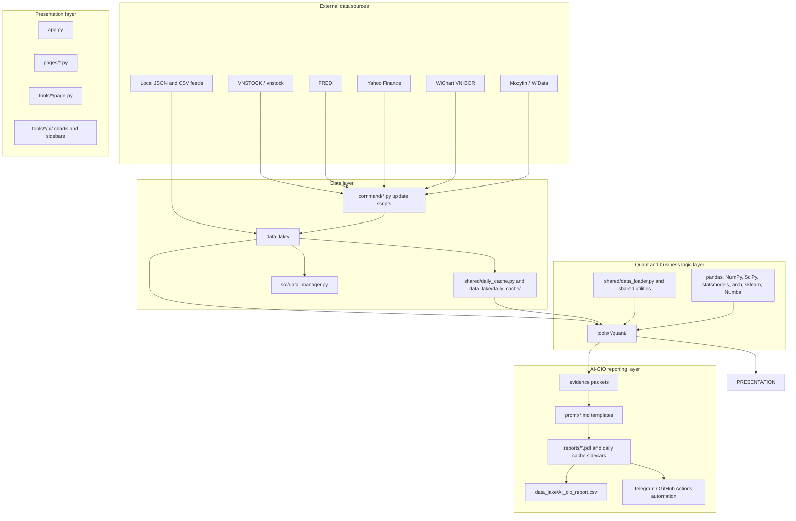
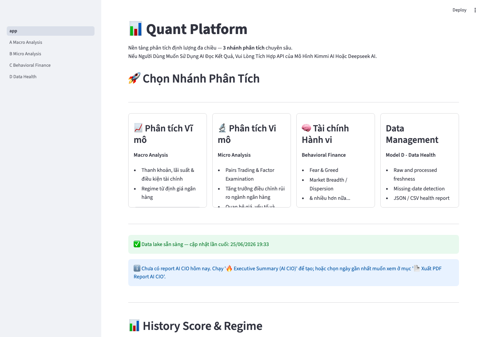
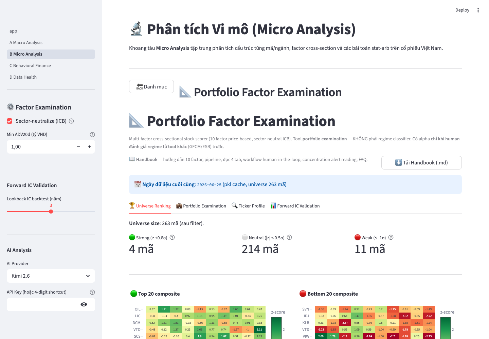
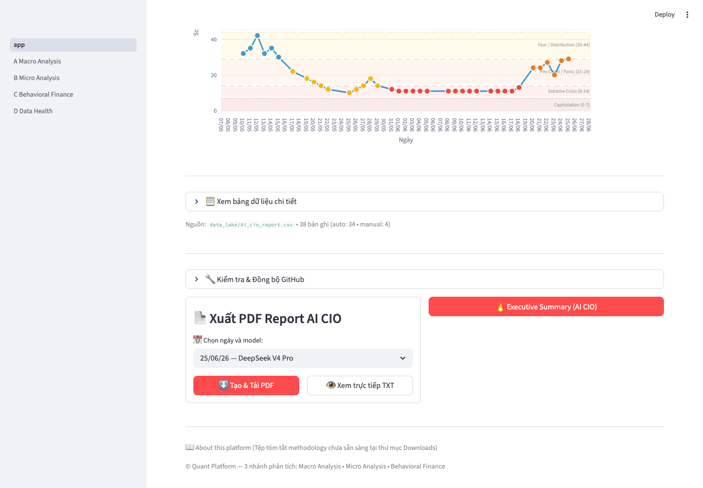

# Vietnam Equities Quant Research & AI-CIO Platform

**A macro-regime-aware systematic research platform for Vietnam equities, combining macro liquidity, systemic stress monitoring, factor research, tail-risk modeling, pairs trading, bank valuation, and AI-assisted CIO reporting.**


This repository is a professional quant research portfolio project, not a retail trading bot. It is designed as a research and decision-support workbench for Vietnam equities, with deterministic quantitative modules feeding structured dashboards and an AI-CIO reporting layer.

The project demonstrates how fragmented market data, macro liquidity, local funding rates, factor signals, behavioral risk, valuation data, and tail-risk diagnostics can be converted into repeatable investment evidence. It does not claim live PnL, guaranteed alpha, production execution, or financial advice.

## Table of Contents

- [What This Demonstrates](#what-this-demonstrates)
- [Why This Project Exists](#why-this-project-exists)
- [Core Capabilities](#core-capabilities)
- [Architecture Overview](#architecture-overview)
- [Quant Methodology Highlights](#quant-methodology-highlights)
- [Data Workflow](#data-workflow)
- [Quickstart](#quickstart)
- [Repository Structure](#repository-structure)
- [AI-CIO Reporting Layer](#ai-cio-reporting-layer)
- [Screenshots / Demo](#screenshots--demo)
- [Known Limitations](#known-limitations)
- [Roadmap](#roadmap)
- [Disclaimer](#disclaimer)

## What This Demonstrates

| Capability | Hiring Signal |
| --- | --- |
| Macro-regime research | Liquidity, global financial conditions, VNIBOR, LTMM transmission indicators |
| Quant risk modeling | EVT VaR/ES, volatility modeling, PCA, HMM/regime classification |
| Systematic equity research | Factor scoring, IC validation, pairs trading, composite backtest framework |
| Research engineering | Modular Streamlit app, local data lake, cache layer, GitHub Actions update workflows |
| AI-assisted investment research | Evidence packets, deterministic context, score/regime ledger, PDF/Telegram reporting |

For hiring managers, this project shows:

- Vietnam equities domain knowledge across macro, market microstructure, bank valuation, and data quality constraints.
- Quantitative risk modeling with tail-risk, volatility, PCA, regime, and factor validation techniques.
- Python research engineering using Streamlit, pandas, NumPy, SciPy, statsmodels, scikit-learn, arch, Numba, and local caching.
- Separation between quant/business logic and UI rendering, where most math lives in `tools/*/quant/` and Streamlit pages act as adapters.
- Awareness of model risk, data leakage, corporate actions, cache invalidation, and production limits.

## Why This Project Exists

Vietnam equities have market features that make generic stock dashboards weak research tools:

- Liquidity and funding conditions matter. Local rates such as VNIBOR, system liquidity, margin conditions, and global dollar stress can dominate short-term risk appetite.
- Data quality is uneven. Corporate actions, missing fields, delayed financial statements, and source-specific quirks can create false signals if not handled explicitly.
- Market structure is concentrated. Banks, real estate, and large-cap index constituents can drive broad index behavior, while retail participation amplifies sentiment cycles.
- Regimes shift quickly. A useful research process needs to connect macro stress, internal breadth, valuation, factor quality, and downside risk instead of treating each chart in isolation.

The platform frames Vietnam equity research as an evidence pipeline: collect data, compute model outputs, validate assumptions, surface model limitations, and synthesize a CIO-style decision brief. The goal is repeatable research and risk-aware decision support, not autonomous trading.

## Core Capabilities

| Research Area | Module / Tool | Methods | Output | Hiring Signal |
| --- | --- | --- | --- | --- |
| Macro liquidity and global conditions | `tools/fed_liquidity`, `tools/global_financial_conditions`, `command/update_fed_liquidity.py`, `command/update_global_financial_conditions.py` | FRED WALCL/TGA/RRP, net liquidity, weekly impulse, rolling z-scores, expanding point-in-time PCA | Liquidity signal, stress regime, PC1/PC2, stress drivers | Macro-regime research without look-ahead PCA |
| Local funding and liquidity transmission | `tools/vnibor`, `tools/ltmm`, `command/update_vnibor.py`, `data_lake/data_LTMM/` | VNIBOR impulse, 5-day smoothing, rate percentiles, 1W/2W spreads, FLI/MLI/TE/FRI trigger snapshots | Local liquidity regime and transmission bottleneck evidence | Vietnam money-market specialization |
| Systemic, behavioral, and internal risk | `tools/esr_monitor`, `tools/fear_greed`, `tools/market_breadth`, `tools/upside_ratio`, `tools/dispersion` | Stress pillars, expanding-window PCA, HMM support, EGARCH skewed-t, Kelly skewness, breadth/dispersion diagnostics | Stress index, fear/greed score, participation, upside/downside, dispersion | Multi-layer risk regime monitoring |
| Tail risk and VaR/ES | `tools/var_cvar_vnindex`, `tools/va_res` | Rolling Gaussian VaR, historical VaR, Expected Shortfall, EVT POT-GPD, Hill estimator, threshold sensitivity | VNINDEX VaR/ES and tail stability diagnostics | Market risk and extreme-loss modeling |
| Factor research | `tools/factor_examination` | Momentum, reversal, low-vol, beta, idio-vol, Amihud liquidity, size, anti-lottery; robust z-score; sector neutralization; IC validation | Cross-sectional ranks, factor exposures, IC summaries, decile diagnostics | Systematic equity research workflow |
| Pairs trading | `tools/pairs_trading` | Engle-Granger, Johansen, OU half-life, Hurst, z-score spreads, dynamic correlation filter, mini/aggregate backtests | Candidate pairs, spread diagnostics, live research signals | Statistical arbitrage research |
| Bank valuation and fundamentals | `tools/bank_valuation`, `tools/risk_adjusted_growth`, `tools/vn100_earnings_health` | Adjusted book value, sustainable ROE, residual income, justified P/B, credit/funding/capital/collateral risk, growth quality, sector diffusion | Fair value, valuation gap, stress value, risk classification, VN100 health ledger | Bottom-up valuation plus systematic overlays |
| Valuation and sentiment overlays | `tools/pvgo`, `tools/sentiment_factor_news` | PVGO / P/E / cost-of-equity context, Mozyfin/WiData connectors, rule-based taxonomy, channel scoring | Growth-expectation context, 1d/7d/30d sentiment feed, headline drivers | Alternative data and valuation-context integration |
| Backtest and data health | `tools/backtest`, `pages/D_Data_Health.py`, `src/data_manager.py` | Composite risk signal, logistic allocation, ESR overlay, MA200 cap, transaction fee, freshness checks, missing-date timeline | Strategy diagnostics, allocation history, data lake health report | Research validation and data operations |
| AI-CIO synthesis | `shared/ai_cio.py`, `promt/`, `command/run_ai_cio_auto.py` | Evidence packets, deterministic context, score/regime parser, ledger, PDF export, Telegram/GitHub Actions delivery | CIO-style research brief and `data_lake/Ai_cio_report.csv` history | Bounded LLM research workflow |

## Architecture Overview



Important architectural point: Streamlit does not own the research math. Quant modules return structured data, diagnostics, and report snapshots; page modules render them. This separation makes the research layer easier to test, cache, reuse in notebooks, and integrate into automation.

## Quant Methodology Highlights

| Method | Problem It Solves | Used In | Why It Matters |
| --- | --- | --- | --- |
| Expanding point-in-time PCA | Avoids historical revisions from future covariance information | `global_financial_conditions`, `fear_greed`, `esr_monitor` | Reduces look-ahead bias in regime and market-factor extraction |
| EVT POT-GPD | Models extreme left-tail losses beyond ordinary historical quantiles | `var_cvar_vnindex` | VaR/ES estimation in fat-tailed Vietnam equity returns |
| Hill tail-index diagnostic | Cross-checks GPD shape stability | `var_cvar_vnindex` | Helps detect unstable tail fits and threshold sensitivity |
| EGARCH skewed-t with fallback | Models asymmetric volatility and fat tails while surviving optimizer failures | `fear_greed` | Keeps volatility signals available during noisy market regimes |
| Kelly skewness | Measures robust return asymmetry | `fear_greed` | Captures downside/upside imbalance without relying only on moment skew |
| HMM and rule-based regimes | Converts continuous stress indices into interpretable market states | `esr_monitor`, `tools/backtest` | Useful for stress monitoring and allocation overlays |
| Engle-Granger and Johansen tests | Tests long-run relationships among equity prices | `pairs_trading` | Separates statistical-arbitrage candidates from high-correlation noise |
| OU half-life and Hurst | Filters spread mean reversion speed and persistence | `pairs_trading` | Helps reject spreads that are too noisy, too slow, or drifting |
| DCC-GARCH / EWMA dynamic correlation | Monitors relationship breakdown after pair selection | `shared/dcc_garch.py`, `pairs_trading/quant/dcc_filter.py` | Adds a short-run co-movement check to long-run cointegration tests |
| Factor scoring and IC validation | Converts price/volume effects into sector-neutral cross-sectional evidence | `factor_examination` | Supports systematic ranking and forward return validation |
| Residual income model | Values banks from adjusted book, sustainable ROE, and cost of equity | `bank_valuation` | Connects bottom-up bank accounting to equity valuation |
| Composite allocation backtest | Tests a risk-aware allocation rule from model outputs | `backtest` | Demonstrates research-to-portfolio translation without claiming live alpha |

## Data Workflow

The repository includes a local data lake and update scripts. Some files are committed as snapshots so the app can run locally without every external feed being live at startup.

Common data artifacts:

- `data_lake/market_data.csv` and `data_lake/market_volume.csv`: equity close and volume panel.
- `data_lake/vnindex_cache.csv` and `data_lake/vn30_cache.csv`: index data.
- `data_lake/fed_liquidity_cache.csv`: Fed liquidity monitor cache.
- `data_lake/global_financial_conditions_cache.csv`: global stress monitor cache.
- `data_lake/LaiSuatLienNganHang_Wichart.csv`: VNIBOR/local rates cache.
- `data_lake/sentiment_factor_news/feed/`: classified sentiment feed outputs.
- `data_lake/bank_valuation/`, `data_lake/risk_adjusted_growth/`, `data_lake/vn100_earnings_health/`: fundamental and valuation data stores.
- `data_lake/daily_cache/`: model/report caches and AI-CIO sidecars.
- `reports/`: generated AI-CIO PDFs.

Representative update commands:

```bash
# Market data from tickers.csv through vnstock
python3 -m command.update_data
python3 -m command.update_data --backfill 2190
python3 -m command.update_data --from-date 2020-01-01

# Macro and rates
FRED_API_KEY=... python3 command/update_fed_liquidity.py
FRED_API_KEY=... python3 command/update_global_financial_conditions.py
python3 -m command.update_vnibor
FRED_API_KEY=... python3 command/update_us_margin_m2.py

# Precompute research artifacts
python3 -m command.update_factor_examination
python3 -m command.update_pvgo_valuation
python3 -m command.update_vn100_corporate_health
python3 -m command.update_abm_data

# Alternative data / news sentiment
python3 command/update_sentiment_factor_news.py --once --source mozyfin
python3 command/update_sentiment_factor_news.py --once --source widata

# Reports
python3 command/generate_report.py

# Visual screenshot PDF report. TODO: verify/install Playwright and Pillow,
# because they are imported by the script but are not listed in requirements.txt.
python3 command/generate_visual_report.py --base-url http://localhost:8501
```

There are also helper scripts:

- `Run_App.command` / `Run_App.bat`: launch Streamlit on port `8502`.
- `Run_All_Updates.command` / `Run_All_Updates.bat`: run a local multi-step data refresh.
- `.github/workflows/*.yml`: scheduled and on-demand GitHub Actions for market data, Fed liquidity, global conditions, sentiment feed, US margin/M2, command runner, and AI-CIO reports.

## Quickstart

### macOS / Linux

```bash
git clone https://github.com/cuocsongthinhvuong8868-sketch/onl_quant-platform.git
cd onl_quant-platform

python3 -m venv .venv
source .venv/bin/activate

python -m pip install --upgrade pip
python -m pip install -r requirements.txt

python -m streamlit run app.py
```

### Windows PowerShell

```powershell
git clone https://github.com/cuocsongthinhvuong8868-sketch/onl_quant-platform.git
cd onl_quant-platform

py -3.11 -m venv .venv
.venv\Scripts\activate

python -m pip install --upgrade pip
python -m pip install -r requirements.txt

python -m streamlit run app.py
```

### Optional Configuration

Create a local `.env` file or configure Streamlit/GitHub secrets as needed. Do not commit secrets; `.env` and `.streamlit/secrets.toml` are ignored by `.gitignore`.

Common optional variables:

| Variable | Used For |
| --- | --- |
| `VNSTOCK_API_KEY` | vnstock market data access when required by the source |
| `FRED_API_KEY` | Fed liquidity, global financial conditions, US margin/M2 |
| `DEEPSEEK_API_KEY` | Scheduled AI-CIO automation through `command/run_ai_cio_auto.py` |
| `TELEGRAM_BOT_TOKEN`, `TELEGRAM_CHAT_ID` | Optional Telegram AI-CIO delivery |
| `TELEGRAM_SEND_FULL_PDF` | Set to `1`/`true` to attach the full AI-CIO PDF in Telegram automation |
| `GITHUB_TOKEN` | Streamlit/GitHub cache sync and workflow output commits |
| `WIDATA_SIGN_TOKEN` | WiData sentiment feed |
| `MOZYFIN_ACCESS_TOKEN`, `MOZYFIN_API_KEY`, `MOZYFIN_COOKIES_JSON` | Mozyfin news sentiment feed |
| `KIMI_LOCAL_BASE_URL`, `KIMI_LOCAL_MODEL`, `KIMI_LOCAL_TEMPERATURE`, `KIMI_LOCAL_TIMEOUT` | Optional local Kimi-compatible endpoint |
| `AI_KEY_1234` style Streamlit secrets | Optional 4-digit API key shortcuts used by `shared/api_key_helper.py` |
| `LTMM_GOLD_DIR` | Optional ABM/LTMM gold CSV sync source |

### Tests

The repository contains targeted tests under `tests/` for AI-CIO post-processing, data management, page-layout auth, bank valuation, methodology controls, and sentiment feed logic.

```bash
python -m pip install pytest  # if pytest is not already installed
PYTHONPATH=. pytest -q
```

## Repository Structure

```text
.
|-- app.py                         # Streamlit home and AI-CIO report controls
|-- pages/                         # Multipage Streamlit wrappers
|-- tools/                         # Research modules, quant engines, UI adapters, reports
|-- shared/                        # Data loading, cache, AI-CIO, DCC-GARCH, GitHub sync, layout
|-- command/                       # Data update, report generation, automation entry points
|-- src/                           # Data health / data management utilities
|-- docs/                          # Methodology and module handbooks
|-- data_lake/                     # Local data snapshots, model outputs, caches, ledgers
|-- reports/                       # Generated PDF reports
|-- promt/                         # AI-CIO and tool prompt templates
|-- tests/                         # Pytest coverage for selected methodology and infrastructure paths
|-- .github/workflows/             # Scheduled and on-demand automation
|-- requirements.txt
`-- README.md
```

## AI-CIO Reporting Layer

The AI-CIO layer is not a replacement for deterministic models. It is a synthesis layer on top of structured evidence generated by the quant modules.

Implemented behavior includes:

- Child-tool reports and structured evidence packets from macro, valuation, sentiment, risk, and market-internal modules.
- A deterministic decision-state object with score/regime parsing and hard-constraint context.
- Prompt templates under `promt/` that constrain the LLM to supplied evidence.
- Context sidecars in `data_lake/daily_cache/ai_cio_context_*.json` and metric snapshots in `data_lake/ai_cio_metrics/`.
- Report history in `data_lake/Ai_cio_report.csv`.
- PDF generation in `app.py` and `command/run_ai_cio_auto.py`.
- Optional Telegram delivery and GitHub Actions automation for scheduled reporting.

This layer should be treated as research decision support. The LLM summarizes, reconciles, and explains evidence; it should not be interpreted as an autonomous allocation engine or trading advisor.

## Screenshots / Demo

These screenshots were generated from the local Streamlit app using `python3 -m streamlit run app.py --server.port=8502 --server.headless=true`.

### Home / Dashboard



### Factor Examination



### AI-CIO Report



## Known Limitations

These are intentional research and engineering notes. They make the platform stronger because they identify model risk and production gaps instead of hiding them.

- `shared/ai_cio.py` is large and should be refactored into a registry-based reporting architecture with smaller tool adapters.
- Pairs trading should use a fully adjusted price pipeline for dividends, splits, and corporate actions. The current pairs module explicitly warns that prices are not guaranteed to be adjusted.
- Several UI/reporting paths still use broad `except Exception:` blocks. These should be replaced with specific exceptions, structured logging, and testable failure states.
- `shared/dcc_garch.py` exists and is wrapped by pairs trading, but pairs workflows default to EWMA correlation in several paths. DCC-GARCH should be exposed and validated more consistently if it becomes part of the core pair filter.
- Factor composite scores currently default to equal weighting. A regime-aware or IC-weighted factor model is a natural next step.
- Some AI/report cache artifacts use local run date (`date.today()`) rather than the latest available data date. Data-date-aware cache keys would reduce timezone and stale-data ambiguity.
- Long IC validations, aggregate backtests, and visual report generation can be slow in Streamlit. Background jobs or precomputed artifacts would improve cloud reliability.
- Strategy modules need deeper out-of-sample validation, walk-forward reports, transaction-cost sensitivity, and leakage checks before any live research use.
- The AI-CIO layer depends on external LLM behavior and should remain bounded by deterministic evidence, audit trails, and human review.

## Roadmap

Near-term:

- Fix and document the adjusted-price pipeline for pairs trading.
- Add out-of-sample and walk-forward reports for strategy modules.
- Improve factor validation with IC stability, turnover, sector exposure, and decile robustness reports.
- Refactor AI-CIO orchestration into a registry of evidence producers.
- Replace broad exceptions with structured logging and narrower failure handling.

Mid-term:

- Add regime-aware or IC-weighted factor composites.
- Integrate and validate DCC-GARCH filtering more deeply in pairs trading.
- Expand unit and integration tests around data loaders, report generation, and core quant functions.
- Add a Dockerized reproducible environment.
- Improve interview-ready report artifacts and screenshots.

Long-term:

- Build a research notebook gallery for methodology walkthroughs.
- Add a model validation dashboard for leakage, drift, threshold sensitivity, and data freshness.
- Add experiment tracking for factor, regime, and strategy variants.
- Strengthen data quality checks for corporate actions, missing volume, stale financial statements, and source divergence.

## Disclaimer

This repository is for quantitative research, portfolio demonstration, and educational purposes only. It is not financial advice, not a production trading system, and not a guarantee of investment performance. Any live deployment would require independent validation, transaction-cost and liquidity modeling, risk controls, monitoring, legal/compliance review, and human oversight.
