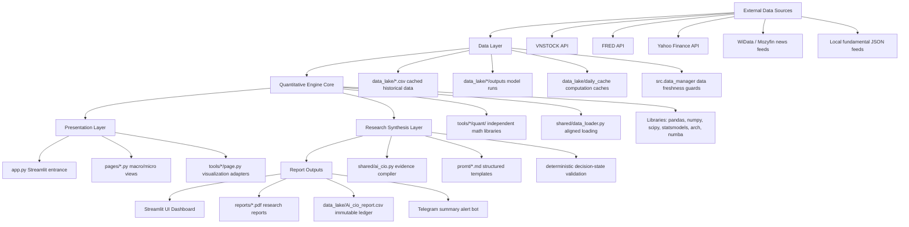

# Emerging Market Quantitative Research & Strategy Platform

**A macro-regime-aware systematic research framework for Vietnam equities, combining central bank liquidity modeling, systemic stress monitoring, equity factor research, extreme-tail risk estimation, relative-value cointegration, and audit-logged research synthesis.**


This project is a modular quantitative research platform engineered for Vietnam equities. It integrates macro liquidity indicators, global and local financial stress monitors, cross-sectional equity factor models, tail-risk estimations, statistical arbitrage diagnostics, and bank valuation overlays. 

It is designed as an institutional research and strategy workbench, separating deterministic quantitative math from presentation logic. It serves as a decision-support and stress-testing system, not an automated execution engine or retail trading application.

---

## 1. Institutional Context & Frontier Market Microstructure

Vietnam equities present a distinct microstructure and research profile:
* **High Retail Participation:** Over 90% of daily trading volume is retail-driven, leading to high noise-to-signal ratios, extreme herd behavior, and frequent sentiment-driven volatility spikes.
* **Fragmented & Unadjusted Data:** Corporate actions (stock splits, dividend payments) often corrupt raw price series, creating artificial structural breaks in cointegration models.
* **Macro & Liquidity Sensitivity:** Capital flows are highly sensitive to interbank funding liquidity (VNIBOR), global dollar liquidity regimes, and credit quotas (system-wide lending limits).
* **High Sector Concentration:** The index is heavily weighted toward Financials (Banks) and Real Estate, requiring robust sector neutralization in cross-sectional models.

This platform converts raw market feeds, central bank balance sheets, interbank rates, and sentiment indicators into structured, repeatable research evidence. The goal is not discretionary stock-picking, but rather **systematic signal validation, tail-risk pricing, and audit-logged strategy synthesis**.

---

## 2. Core Capabilities

| Research Area | Module / Tool | Quantitative Methods & Math | Research Output | Target Quant Competency & Safeguard |
|---|---|---|---|---|
| **Macro Liquidity** | `tools/fed_liquidity` | FRED WALCL, TGA, RRP; Central Bank Net Liquidity proxy; weekly liquidity impulse; EWMA z-scores | Net liquidity trend metrics and weekly velocity signals | Central bank balance sheet modeling, credit impulse analysis |
| **Global Financial Conditions** | `tools/global_financial_conditions` | Multi-asset macro proxies; rolling percentile stress rankings; expanding point-in-time PCA | Global stress index (CQS percentile) and principal drivers | **Look-ahead bias prevention** via expanding-window eigenvectors |
| **Local Funding** | `tools/vnibor` | VNIBOR term structure slope modeling, daily percentile regime classification | Interbank funding liquidity states and yield-curve slope diagnostics | Local money market knowledge, interest rate term structure analysis |
| **Systemic Stress** | `tools/esr_monitor` | VN30 stress pillars (volatility clustering, cross-sectional dispersion, funding pressure), expanding PCA | Systemic Stress Index (SSI); rule-based and HMM regime classification | Multi-dimensional stress indexing, regime classification |
| **Behavioral Risk** | `tools/fear_greed` | Point-in-time PCA market factor, EGARCH(1,1,1) tail volatility model with skewed Student-t innovations, Kelly skewness | Sentiment-driven risk score and market-internal volatility indicators | **Robust volatility fallback routine** under MLE optimizer divergence |
| **Market Breadth** | `tools/market_breadth`, `tools/upside_ratio` | Cross-sectional MA participation, volume-weighted concentration, Monte Carlo simulated breadth envelope | Participation density, upside/downside ratio, dispersion diagnostics | Market microstructure, cross-sectional dispersion, ensemble simulations |
| **Tail Risk** | `tools/var_cvar_vnindex`, `tools/va_res` | Extreme Value Theory (EVT) Peaks-Over-Threshold (POT) fitted to Generalized Pareto Distribution (GPD); Hill tail-index estimator | Extreme VaR / Expected Shortfall (ES) at 99% and 99.5% tail levels | **Threshold sensitivity analysis** validating model stability |
| **Factor Research** | `tools/factor_examination` | Momentum, reversal, low-vol, beta, idiosyncratic vol, Amihud illiquidity, size, anti-lottery retail bias; outlier-trimmed z-scores | Cross-sectional factor ranks and Information Coefficient (IC) validation | Equity factor implementation, sector neutralization, IC decay validation |
| **Statistical Arbitrage** | `tools/pairs_trading` | Engle-Granger 2-step (ADF $p < 0.05$), Johansen trace/VECM, Ornstein-Uhlenbeck (OU) half-life, Hurst exponent, DCC-GARCH | Trading candidate screening, spread mean-reversion metrics, live trading signals | **Capital-constrained sizing** using rolling hedge ratios |
| **Bank Valuation** | `tools/bank_valuation`, `tools/risk_adjusted_growth` | Adjusted book value (non-performing loan haircuts), sustainable ROE, residual income projections, risk-adjusted growth | Bank fair value, valuation gaps, P/B regime analysis, credit/capital flags | Bottom-up equity modeling integrated with systematic risk scores |
| **Corporate Health** | `tools/vn100_earnings_health` | Financial statement normalization, growth quality, cash conversion, leverage stress, sector diffusion | VN100 corporate health score ledger and fundamental diagnostics | Fundamental data engineering, cross-sectional balance sheet scoring |
| **Valuation Overlay** | `tools/pvgo` | VNINDEX PVGO / P/E / COE-style valuation context | Growth-expectations and valuation-risk context | Linking expectation metrics to macroeconomic regime models |
| **News Sentiment** | `tools/sentiment_factor_news` | Headline classification taxonomy, TF-IDF / rule-based sentiment factor extraction | Sentiment time-series feed and news narrative drivers | Alternative data engineering, reproducible news classification |
| **Automated Synthesis** | `shared/ai_cio.py`, `promt/` | Deterministic evidence compilation, structured context injection, audit-trail generation (ledger & context sidecars) | Executive summary, score/regime ledger, audit-trail files | **LLM alignment under strict quantitative boundaries** |

---

## 3. Platform Architecture



The codebase separates deterministic quantitative logic from presentation and rendering frameworks:
* **Quantitative Engine Core (`tools/*/quant/`)**: Raw mathematical calculations written in pure Python/NumPy/Pandas/SciPy/Statsmodels/Numba. These modules contain no presentation dependencies, allowing them to be imported and run in automated backtesting pipelines or Jupyter notebooks.
* **Data Lake Layer (`data_lake/`)**: A local repository-local cache of raw and pre-computed files. Data freshness checkers in `src/` ensure that no stale inputs enter calculations.
* **Research Synthesis Layer (`shared/ai_cio.py`, `promt/`)**: Translates quantitative outputs into structured evidence packets. The LLM acts strictly as a deterministic text compiler, constrained by markdown templates (`promt/`) and forced to cite metrics. It records a decision-state JSON and updates an immutable ledger (`data_lake/Ai_cio_report.csv`) for complete auditability.
* **Presentation Layer (`app.py`, `pages/`)**: Streamlit dashboards presenting charts, diagnostics, and reports on demand, utilizing disk caching to prevent redundant calculations.

---

## 4. Quantitative Methodology & Mathematical Controls

### 4.1. Extreme Value Theory (EVT POT-GPD) Tail Risk Modeling
Emerging market equities display high kurtosis and negative skewness, making standard Gaussian VaR parametric models highly inaccurate. Simple historical VaR is highly unstable due to small sample sizes in the tail (e.g., only 7 tail observations in a 3-year window).

The platform implements the Pickands-Balkema-de Haan (1974, 1975) theorem. For a sufficiently high threshold $u$, the conditional distribution of exceedances $Y = (X - u \mid X > u)$ converges to the Generalized Pareto Distribution (GPD):

$$F_u(y) \approx G_{\xi, \beta}(y) = 1 - \left(1 + \frac{\xi y}{\beta}\right)^{-1/\xi} \quad \text{for } \xi \neq 0$$

Where $\xi$ is the shape parameter (tail heaviness) and $\beta$ is the scale parameter.
1. The threshold $u$ is chosen dynamically as the 90th percentile of the negative daily returns (losses).
2. The GPD parameters are estimated using Maximum Likelihood Estimation (MLE).
3. The Value-at-Risk ($VaR_\alpha$) and Expected Shortfall ($ES_\alpha$) are computed using the closed-form GPD solutions:

$$VaR_\alpha = u + \frac{\beta}{\xi} \left[ \left( \frac{n}{N_u} (1 - \alpha) \right)^{-\xi} - 1 \right]$$

$$ES_\alpha = \frac{VaR_\alpha}{1 - \xi} + \frac{\beta - \xi u}{1 - \xi}$$

A non-parametric Hill tail-index estimator is calculated concurrently to cross-check $\xi$ stability and prevent MLE optimizer errors.

### 4.2. Expanding Window Point-in-Time PCA
Standard PCA run over a complete dataset introduces look-ahead bias because future covariance matrices influence the eigenvectors. To model global and behavioral conditions without leakage, we use an **expanding window point-in-time PCA**:

$$\mathbf{\Sigma}_t = \text{Cov}(\mathbf{X}_{t_0:t})$$

$$\mathbf{\Sigma}_t \mathbf{w}_{i,t} = \lambda_{i,t} \mathbf{w}_{i,t}$$

* Loadings $\mathbf{w}_{i,t}$ and eigenvalues $\lambda_{i,t}$ are computed using only information available up to time $t$.
* To optimize execution, PCA models are refitted at a set frequency (e.g., every 10 trading sessions) rather than daily, which matches institutional risk reporting cycles.
* Unit tests enforce that appending new data does not rewrite historical factor values.

### 4.3. Robust Volatility Fallbacks
To ensure continuous estimation of behavioral volatility under turbulent market regimes, the volatility engine utilizes a hierarchical fallback structure:
1. **EGARCH(1,1,1)** with skewed Student-t innovations: Chosen to model asymmetric leverage effects (where negative shocks increase volatility more than positive shocks) and fat tails.
2. **GARCH(1,1)** with Gaussian innovations: Activated if the EGARCH MLE solver fails to converge on noisy returns.
3. **RiskMetrics EWMA**: Activated if the GARCH optimizer fails, ensuring a stable, uninterrupted risk signal output.

### 4.4. Cointegration & Mean-Reversion Spread Dynamics
The relative-value pairs trading engine filters pairs hierarchically to verify statistical viability:
1. **Cointegration Test:** Engle-Granger two-step regression of $\ln(p_{1,t}) = \alpha + \beta \ln(p_{2,t}) + \epsilon_t$, applying an ADF test on the residuals $\epsilon_t$ (rejecting non-stationarity at $p < 0.05$). Johansen trace tests are run for multi-asset spreads.
2. **Mean-Reversion Speed:** Residuals are modeled as an Ornstein-Uhlenbeck (OU) process:

$$d\epsilon_t = \theta (\mu - \epsilon_t) dt + \sigma dW_t$$

We solve via OLS: $\Delta \epsilon_t = a + b \epsilon_{t-1} + e_t$. The half-life is computed as:

$$HL = \frac{\ln(2)}{\theta} \quad \text{where } \theta = -b$$

Pairs are strictly restricted to $HL \in [5, 30]$ trading days to match typical risk-arbitrage capital horizons.
3. **Dynamic Correlation:** Spreads are filtered using Dynamic Conditional Correlation (DCC-GARCH) to gate pairs experiencing correlation breakdowns.

---

## 5. Model Validation & Statistical Safeguards

To address model risk, the repository implements automated testing (`pytest`) covering critical structural assumptions:

* **Look-Ahead Bias Invariance:** Tests verify that when future returns are appended to the dataset, historical PCA outputs (GFC and Fear & Greed indices) remain unchanged.
* **Optimizer Fallback Verification:** Mocks are used to force EGARCH convergence failures, verifying that the system degrades gracefully to GARCH and EWMA without throwing uncaught exceptions.
* **Threshold Stability Grids:** The EVT framework implements `evt_threshold_sensitivity` to calculate VaR and Expected Shortfall across a grid of POT thresholds (5% to 15%). Model confidence requires that the shape parameter $\xi$ remains stable and within normal equity ranges ($\xi \in [0.15, 0.45]$).
* **Ensemble Reproducibility:** Confirms that Monte Carlo breadth simulations produce identical envelopes when using fixed seeds.
* **Neutral Hedge Sizing:** Validates that pairs trading order tickets size long/short legs dynamically using rolling betas, maintaining market neutrality under capital constraints.

---

## 6. Quickstart & Reproducibility

### 6.1. Local Sandbox (No API Keys Required)
The repository is committed with a pre-populated data snapshot inside `data_lake/` (market data, interbank rates, macro caches, and bank details). **No API registration is required to run the local Streamlit dashboard or test suite.**

### 6.2. Installation

```bash
# Clone the repository
git clone <repo-url>
cd onl_quant-platform

# Create virtual environment
python -m venv .venv
source .venv/bin/activate  # Windows: .venv\Scripts\activate

# Install dependencies
pip install -r requirements.txt
```

### 6.3. Running Validation Tests
Execute the test suite to verify the statistical invariants and fallback paths:

```bash
PYTHONPATH=. pytest -v
```

### 6.4. Running the Dashboard
Launch the interactive Streamlit research app locally:

```bash
streamlit run app.py
```
*(Alternatively, macOS users can execute the helper script: `./Run_App.command`)*

### 6.5. Ingestion & In-Production Updates
To update the underlying databases (requires active API keys mapped in environment variables / `.env` file):

```bash
# Update core market data
python command/update_data.py

# Ingest and update specific risk monitors
python command/update_fed_liquidity.py
python command/update_global_financial_conditions.py
python command/update_vnibor.py
python command/update_factor_examination.py
python command/update_pvgo_valuation.py

# Run corporate health and alternative sentiment feeds
python -m command.update_vn100_corporate_health
python command/update_sentiment_factor_news.py --once --source mozyfin

# Generate automated report and update report ledger
python command/run_ai_cio_auto.py --force
```

---

## 7. Model Risk & Research Boundaries

The platform operates within specific model risk boundaries:
1. **Price Adjustment Constraints:** Pairs trading models utilize raw historical prices; spreads are susceptible to artificial breaks around corporate action dates (stock splits, stock dividends). Real-time trading requires adjusting prices for corporate actions.
2. **Transaction Cost Invariance:** The strategy backtester assumes zero transaction fees, zero slippage, and infinite liquidity. True alpha estimation requires incorporating Vietnam-specific transaction taxes, trading commissions, and market impact models.
3. **Factor Orthogonalization:** Ranks in `factor_examination` are sector-neutralized but lack multi-factor risk model orthogonalization. Composite signals may carry unintended exposures to macroeconomic growth or interest rate shifts.
4. **Regime Drift:** Regime classification frameworks (SSI and HMM) assume historical cycle dynamics are repeatable. They are subject to drift under structural shifts, such as changes in foreign ownership regulations or state monetary frameworks.
5. **Alternative Data Bias:** News sentiment is classified using TF-IDF / keywords mapping local news feeds. This methodology is prone to classification error and reporting bias from state-influenced local financial media.

---

## 8. Target Quant Competencies

This codebase demonstrates specific competencies key for **Quantitative Research Analyst**, **Systematic Portfolio Manager**, **Quant Developer**, and **Risk Quant** roles:
* **Time-Series Invariance:** Implementing point-in-time expanding window estimation models.
* **Emerging Market Microstructure:** Designing factor models and cointegration rules adapted to retail-dominated, illiquid markets.
* **Risk Engineering:** Fitting GPD distributions under EVT theory, implementing threshold sensitivity checks, and coding robust numerical fallback logic.
* **Software Cleanliness:** Separating core mathematical computation (`tools/*/quant/`) from presentation frameworks (`app.py`), writing clean unit tests, and establishing automated logging.
* **Bounded AI System Design:** Formatting structured context and defining deterministic decision-states to utilize LLMs as objective compilers, preventing hallucination.

---

## 9. Disclaimer

This platform is intended for quantitative research and educational validation only. It does not constitute investment advice. No live execution results, trading performance, or alpha capacity claims are implied. Any deployment in a live trading environment requires separate validation, compliance audits, and execution risk-control setups.
