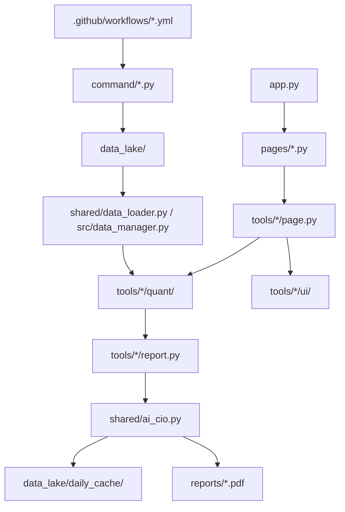

# onl_quant-platform

**Vietnam equities quant research platform + AI-CIO evidence pipeline.**


`onl_quant-platform` la mot Streamlit research workbench cho thi truong co phieu Viet Nam. Du an tap trung vao macro liquidity, market internals, behavioral risk, tail risk, factor research, pairs trading, valuation va AI-assisted CIO reporting.

Day khong phai retail trading bot va khong phai he thong dat lenh. Nen tang bien du lieu phan manh thanh evidence co cau truc de phuc vu nghien cuu, review regime va tao bao cao dau tu co audit trail.

## Muc Luc

- [Diem chinh](#diem-chinh)
- [Methodology tóm tắt](#methodology-tóm-tắt)
- [Kien truc qua CodeGraph](#kien-truc-qua-codegraph)
- [Tool map](#tool-map)
- [Data workflow](#data-workflow)
- [Quickstart](#quickstart)
- [Cau hinh tuy chon](#cau-hinh-tuy-chon)
- [Tests](#tests)
- [Cau truc repository](#cau-truc-repository)
- [AI-CIO layer](#ai-cio-layer)
- [AI-CIO Chat](#ai-cio-chat)
- [Gioi han hien tai](#gioi-han-hien-tai)
- [Disclaimer](#disclaimer)

## Diem chinh

- **Macro-regime research**: Fed liquidity, global financial conditions, VNIBOR, LTMM va bank valuation breadth.
- **Market risk stack**: Fear & Greed, ESR, breadth, dispersion, VaRES, EVT VaR/CVaR, ABM cascade monitor.
- **Systematic equity research**: factor examination, IC validation, pairs trading, risk-adjusted growth, VN100 corporate health.
- **Valuation context**: bank residual income/justified P/B, PVGO/P-E context, bottom-up financial statement processing.
- **AI-CIO synthesis**: child reports, evidence packets, history ledger, humility/falsification context, PDF/Telegram/GitHub automation.
- **AI-CIO Data Agent**: hoi dap nhieu luot bang native read-only tools, co audit trail, bang/bieu do va retrieval fallback.
- **Research engineering**: multipage Streamlit app, local data lake, daily cache, CLI update scripts, GitHub Actions and targeted pytest coverage.

## Methodology Tóm tắt

Chi tiết ngắn gọn nằm trong [docs/about_this_platform.md](docs/about_this_platform.md). App home cũng đọc file này trực tiếp trong block **About this platform (Tóm tắt Methodology)**.

Nen tang di theo pipeline:

1. **Collect**: updater trong `command/` lay price/volume, index cache, macro series, VNIBOR, news feed, valuation/fundamental snapshots va ghi vao `data_lake/`.
2. **Normalize**: `shared/data_loader.py`, `src/data_manager.py`, `config/data_rules.yaml` va cac loader rieng cua tung tool xu ly freshness, missing dates, source quirks va data shape.
3. **Model**: `tools/*/quant/` tinh factor, PCA, z-score, percentile, HMM/rule regime, EVT, valuation, cointegration, sentiment taxonomy va stress metrics.
4. **Render**: `app.py`, `pages/*` va `tools/*/page.py` chi dong vai tro Streamlit adapter; chart/sidebar nam trong `tools/*/ui/`.
5. **Synthesize**: `shared/ai_cio.py` doc child reports va structured context de tao AI-CIO summary co score/regime ledger.

Nguyen tac quan trong:

- Tranh look-ahead trong cac PCA/regime path bang expanding/point-in-time fitting.
- Khong forward-fill volume trong cac path can do liquidity/stress.
- LLM khong thay the model dinh luong; LLM chi tong hop evidence da tinh san.
- Cache tinh toan can co methodology/version flag khi thay doi logic.
- Ket qua la decision support, can human review va validation doc lap.

## Kien Truc Qua CodeGraph

CodeGraph da duoc sync trong lan review nay:

| Metric | Gia tri |
| --- | ---: |
| Indexed files | 343 |
| Nodes | 4,201 |
| Edges | 9,948 |
| Python files | 333 |
| YAML files | 10 |

Luong phu thuoc chinh:



CodeGraph cung cho thay cac hot paths can can trong khi sua:

- `shared/ai_cio.py:run_executive_summary()` duoc goi tu `app.py` va `command/run_ai_cio_auto.py`.
- `shared/daily_cache.py:load_daily_cache()` duoc nhieu page dung, nen thay doi cache key co blast radius rong.
- `shared/tool_registry.py` la registry metadata chung cho branch/page/report/cache/AI-CIO role.
- `pages/*` import dong `tools.<name>.page.render()` qua registry; tool moi nen theo pattern `quant/`, `ui/`, `page.py`, optional `report.py`.

## Tool Map

| Branch | Tool | Module | Methodology / output |
| --- | --- | --- | --- |
| Macro | Fed Liquidity | `tools/fed_liquidity` | WALCL - TGA - RRP, weekly impulse, z-score, ADD/CUT/HOLD signal |
| Macro | Global Financial Conditions | `tools/global_financial_conditions` | 11 indicators, 6-core PCA, PC1 EMA(5), percentile regime |
| Macro | VNIBOR | `tools/vnibor` | Interbank rates, percentile/liquidity regime, trend diagnostics |
| Macro | LTMM | `tools/ltmm` | Liquidity transmission, upstream/friction/downstream snapshots |
| Macro | Bank Valuation | `tools/bank_valuation` | Adjusted book, sustainable ROE, residual income, justified P/B |
| Macro | VN100 Corporate Health | `tools/vn100_earnings_health` | Financial statement normalization, quality/stress/diffusion matrix |
| Macro | Humility/Falsification | `tools/humility_falsification` | Check dieu kien phu dinh cho AI-CIO T-1 |
| Micro | Factor Examination | `tools/factor_examination` | 10 factor scorer, robust z-score, sector neutralization, IC validation |
| Micro | Pairs Trading | `tools/pairs_trading` | Engle-Granger, Johansen, OU half-life, Hurst, z-score signal/backtest |
| Micro | Risk-Adjusted Growth | `tools/risk_adjusted_growth` | Economic Alpha, disciplined return, bank growth quality |
| Behavioral | Fear & Greed | `tools/fear_greed` | PCA market factor, EGARCH/GARCH/EWMA fallback, Kelly skewness |
| Behavioral | Market Breadth | `tools/market_breadth` | MA20/60/125/252 participation and breadth diagnostics |
| Behavioral | ESR Monitor | `tools/esr_monitor` | Stress pillars, volume dry-up, HMM/rule regimes |
| Behavioral | Dispersion | `tools/dispersion` | CSAD/CSSD, DPI, Ledoit-Wolf covariance context |
| Behavioral | VaRES | `tools/va_res` | Cornish-Fisher, VN30 stress, market complacency self-baseline |
| Behavioral | VaR/CVaR VNINDEX | `tools/var_cvar_vnindex` | Gaussian/historical VaR, EVT POT-GPD, Hill/tail diagnostics |
| Behavioral | Manipulation | `tools/manipulation` | VIC/VHM/VRE vs VN30F1M PCA/composite percentile monitor |
| Behavioral | News Sentiment Factor | `tools/sentiment_factor_news` | Mozyfin/WiData feed, taxonomy, channel scores, headline drivers |
| Behavioral | PVGO | `tools/pvgo` | VNINDEX P/E, cost of equity, growth expectation context |
| Behavioral | ABM Simulator | `tools/abm_simulator` | Leverage stress, forced-selling amplification, cascade distance |
| Behavioral | Capitulation Regime | `tools/capitulation_regime` | Point-in-time Three-Gate Climax, post-climax continuation counter va action gate |
| Behavioral | Backtest | `tools/backtest` | Composite risk signal, allocation overlay, strategy diagnostics |
| Data | Data Health | `pages/D_Data_Health.py` | Freshness, missing-date timeline, JSON/CSV health report |

## Data Workflow

Common artifacts:

- `data_lake/market_data.csv`: close price panel.
- `data_lake/market_volume.csv`: volume panel, khong ffill mac dinh.
- `data_lake/vnindex_cache.csv`, `data_lake/vn30_cache.csv`: index cache.
- `data_lake/fed_liquidity_cache.csv`, `data_lake/global_financial_conditions_cache.csv`: macro cache.
- `data_lake/sentiment_factor_news/feed/`: sentiment feed outputs.
- `data_lake/bank_valuation/`, `data_lake/risk_adjusted_growth/`, `data_lake/vn100_earnings_health/`: fundamental/valuation stores.
- `data_lake/daily_cache/`: compute cache, AI text cache, AI-CIO context sidecars.
- `reports/`: generated PDFs.

Representative commands:

```bash
# Market data
python -m command.update_data
python -m command.update_data --backfill 2190
python -m command.update_data --from-date 2020-01-01

# Macro and rates
python command/update_fed_liquidity.py
python command/update_global_financial_conditions.py
python -m command.update_vnibor
python command/update_us_margin_m2.py

# Research artifacts
python -m command.update_factor_examination
python -m command.update_pvgo_valuation
python -m command.update_vn100_corporate_health
python -m command.update_abm_data

# News / alternative data
python command/update_sentiment_factor_news.py --once --source mozyfin
python command/update_sentiment_factor_news.py --once --source mozyfin_social
python command/update_sentiment_factor_news.py --once --source widata

# AI-CIO
python command/run_ai_cio_auto.py --force
python command/generate_report.py
```

## Quickstart

### Windows PowerShell

```powershell
git clone https://github.com/cuocsongthinhvuong8868-sketch/onl_quant-platform.git
cd onl_quant-platform

py -3.11 -m venv .venv
.venv\Scripts\activate

python -m pip install --upgrade pip
python -m pip install -r requirements.txt

python -m streamlit run app.py
```

### macOS / Linux

```bash
git clone https://github.com/cuocsongthinhvuong8868-sketch/onl_quant-platform.git
cd onl_quant-platform

python3 -m venv .venv
source .venv/bin/activate

python -m pip install --upgrade pip
python -m pip install -r requirements.txt

python -m streamlit run app.py
```

Helper scripts:

- `Run_App.bat` / `Run_App.command`: launch Streamlit helper.
- `Run_All_Updates.bat` / `Run_All_Updates.command`: local multi-step data refresh.
- `.github/workflows/*.yml`: scheduled/on-demand automation.

## Cau Hinh Tuy Chon

Secrets/env variables phu thuoc vao feed ban muon dung:

| Variable | Used for |
| --- | --- |
| `VNSTOCK_API_KEY` | vnstock market data khi source yeu cau |
| `FRED_API_KEY` | Fed liquidity, GFCM, US margin/M2 |
| `DEEPSEEK_API_KEY` | Scheduled AI-CIO automation |
| `DEEPSEEK_FINAL_THINKING=true` | Optional: bat thinking chi cho luot tong hop AI-CIO cuoi; mac dinh tat |
| `QUANT_PLATFORM_AI_QUERY_PLANNER=true` | Optional: bat lai remote query planner cua AI-CIO Chat; mac dinh dung deterministic router |
| `QUANT_PLATFORM_NATIVE_TOOL_AGENT=true` | Optional: bat native multi-turn tool calling cho AI-CIO Chat |
| `GITHUB_TOKEN` | Streamlit/GitHub cache sync va workflow commits |
| `TELEGRAM_BOT_TOKEN`, `TELEGRAM_CHAT_ID` | Optional Telegram delivery |
| `WIDATA_SIGN_TOKEN` | WiData sentiment feed |
| `MOZYFIN_ACCESS_TOKEN`, `MOZYFIN_API_KEY`, `MOZYFIN_COOKIES_JSON` | Mozyfin sentiment/fundamental feeds |
| `KIMI_LOCAL_BASE_URL`, `KIMI_LOCAL_MODEL`, `KIMI_LOCAL_TEMPERATURE`, `KIMI_LOCAL_TIMEOUT` | Local Kimi-compatible endpoint |
| `CHATGPT_LOCAL_BASE_URL`, `CHATGPT_LOCAL_MODEL`, `CHATGPT_LOCAL_TEMPERATURE` | Local ChatGPT-compatible endpoint |
| `AI_KEY_1234` style Streamlit secrets | 4-digit API key shortcuts in UI |
| `LTMM_GOLD_DIR` | Optional ABM/LTMM gold CSV sync source |

Khong commit secrets. `.env` va `.streamlit/secrets.toml` duoc ignore.

## Tests

Targeted tests nam trong `tests/`:

- Point-in-time PCA invariance cho Fear & Greed va GFCM.
- EVT threshold sensitivity va posterior interval reproducibility.
- Pairs order ticket hedge sizing.
- Upside Ratio Monte Carlo seed reproducibility.
- DataManager, page layout auth, AI-CIO postprocess, bank valuation pipeline, sentiment feed logic.

Run:

```bash
PYTHONPATH=. pytest -q
```

Windows PowerShell:

```powershell
$env:PYTHONPATH='.'
pytest -q
```

## Cau Truc Repository

```text
.
|-- app.py                         # Streamlit home, AI-CIO controls, methodology summary block
|-- pages/                         # Multipage Streamlit branch wrappers
|-- tools/                         # Research modules: quant/, ui/, page.py, optional report.py
|-- shared/                        # Data loading, cache, registry, AI-CIO, DCC-GARCH, GitHub sync, layout
|-- command/                       # Data update, report generation, automation entry points
|-- src/                           # Data health / data management utilities
|-- docs/                          # Methodology docs and handbooks
|-- data_lake/                     # Local snapshots, model outputs, caches, ledgers
|-- reports/                       # Generated PDF reports
|-- promt/                         # AI-CIO and tool prompt templates
|-- tests/                         # Targeted pytest coverage
|-- .github/workflows/             # Scheduled and manual automation
|-- requirements.txt
`-- README.md
```

## AI-CIO Layer

AI-CIO la synthesis layer, khong phai replacement cho deterministic models.

Core behavior:

- Tinh/lay cache metrics tu macro, risk, valuation, sentiment va market-internal tools; child context duoc render cuc bo, khong goi LLM rieng.
- Build evidence packets, decision-state, metrics snapshot va history ledger.
- Apply humility/falsification context, hard constraints, confidence haircut va tail-risk guardrails.
- Chi goi model mot lan de viet narrative cuoi; score, regime, allocation, confidence, humility JSON va Telegram brief do Python render deterministic.
- Tai su dung executive summary theo content fingerprint khi input/prompt/model khong doi; refresh thu cong (`force=True`) moi xoa cache.
- Ghi `data_lake/Ai_cio_report.csv`, `data_lake/ai_cio_metrics/*.json`, `data_lake/daily_cache/ai_cio_context_*.json`.
- Export PDF qua `app.py` hoac `command/run_ai_cio_auto.py`.
- Optional Telegram delivery va GitHub Actions automation.

LLM chi nen duoc doc nhu mot analyst tong hop bang chung. Cac score/regime va risk constraints can duoc review lai bang metrics goc.

### Capitulation action gate (methodology v2)

Capitulation la phase gate doc lap voi composite score. Score thap chi the hien stress nang; no khong tu dong chung minh thi truong da tao day.

- `CAPITULATION_CLIMAX` chi xuat hien khi dong thoi dat ba gate: price shock, breadth shock va forced-selling evidence. Day la phien moc `sessions_after_three_gate_climax = 0` va `action_eligible = false`.
- Nam phien giao dich ke tiep duoc danh so `+1` den `+5`, co phase `CAPITULATION_CLIMAX_CONTINUATION` va `action_eligible = true`.
- Tu phien `+6`, continuation window ket thuc va detector quay lai phase duoc xac dinh boi liquidation/repair/fragility thong thuong.
- `EXHAUSTION_CONFIRMED` khong con la dieu kien mo action window. Exhaustion evidence score va confirmation reasons van duoc giu lai nhu diagnostic, khong phai xac suat.
- `data_quality.status`, ke ca `INSUFFICIENT`, duoc cong bo de audit nhung khong chan action neu detector da xac dinh duoc continuation. Truong hop detector khong chay duoc hoac state bi stale van fail closed.
- AI-CIO chi kich hoat decision regime `CAPITULATION` khi phase dung, counter la so nguyen trong khoang `1-5`, `action_eligible` la boolean `true` va freshness la `CURRENT`.
- History ledger, metrics snapshot, evidence packet, Data Agent, UI va PDF cung luu/hien `sessions_after_three_gate_climax` de biet dang la phien thu may sau climax.

Methodology version hien tai: `capitulation_state_machine_v2.0.0`. Executive-summary cache version duoc bump khi quy tac gate thay doi de tranh tai su dung bao cao theo logic cu.

## AI-CIO Chat

Trang `pages/E_AI_CIO_Chat.py` cung cap AI-CIO Data Agent v2 tren du lieu cua du an.

- `shared/ai_cio_data_agent.py` chi expose sau native read-only tools: `search_project_data`, `read_timeseries`, `read_project_file`, `get_tool_metrics`, `get_data_health` va `list_quant_tools`.
- Mac dinh moi provider dung deterministic router phia server de chon read-only tools, sau do chi goi model mot lan de tong hop. Remote AI Query Planner la opt-in bang `QUANT_PLATFORM_AI_QUERY_PLANNER=true`; native tool-agent multi-turn la opt-in bang `QUANT_PLATFORM_NATIVE_TOOL_AGENT=true`.
- Agent khong phai coding agent: khong co shell, Python executor, write tool, updater hay quyen truy cap duong dan ngoai allowlist.
- Cau hoi theo thoi gian nhu "3 phien gan nhat" bat buoc parse va sap xep cot ngay qua `read_timeseries`, khong lay `tail()` theo thu tu file.
- UI hien audit trail, file nguon, bang va bieu do ma agent da dung. Co the yeu cau file cu the bang cu phap `@data_lake/vnindex_cache.csv`.
- Khi remote planner duoc bat ma loi/confidence thap, deterministic router phia server van chay cung read-only tools va dua output da gioi han cho model tong hop. `shared/ai_cio_chat.py` chi la retrieval du phong cuoi cung khi tool evidence khong doc duoc.
- Context chat mac dinh toi da 16.000 ky tu, 8 nguon va hai message lich su gan nhat; output moi route duoc gioi han boi `shared/llm_policy.py`.
- `command/build_ai_cio_data_catalog.py` tao `data_lake/ai_cio_data_catalog.json` deterministic, chi chua path/format/size/schema va khong chua row values.
- Cac GitHub Actions data pipeline tai tao catalog sau khi update data. Streamlit Cloud doc catalog da commit thay vi scan toan bo data lake luc khoi dong.
- Tren cloud, provider localhost tu dong bi an; co the force bang `QUANT_PLATFORM_CLOUD_RUNTIME=true`. API key cua provider remote can duoc luu trong Streamlit Secrets/GitHub Secrets.
- Path traversal, ten file secrets va instruction nam trong data source bi chan/vo hieu hoa boi system contract. Pickle/PDF chi duoc index metadata, khong deserialize trong chat.

Tao lai catalog thu cong:

```bash
python -m command.build_ai_cio_data_catalog
```

## Screenshots

Screenshots local:


## Gioi Han Hien Tai

- `shared/ai_cio.py` la module lon; nen refactor sang registry/adapters neu tiep tuc them tool.
- Mot so UI/report path con bat `Exception` rong; nen thay bang exception cu the va structured logging.
- Pairs trading can adjusted-price pipeline tot hon cho dividends, splits va corporate actions.
- Mot so cache/report con dua vao local `date.today()`; data-date-aware keys se giam ambiguity timezone/stale data.
- Long IC validation, aggregate backtest va visual report co the cham tren Streamlit Cloud; nen precompute/background job cho cloud reliability.
- Strategy modules can them out-of-sample, walk-forward, transaction-cost sensitivity va leakage audit truoc khi dung live.
- External LLM/feed behavior khong on dinh; can deterministic evidence, audit trail va human review.

## Disclaimer

Du an nay chi phuc vu research, portfolio demonstration va education. Day khong phai financial advice, khong phai production trading system va khong dam bao hieu qua dau tu. Bat ky live deployment nao deu can validation doc lap, cost/liquidity modeling, risk controls, monitoring, legal/compliance review va human oversight.
