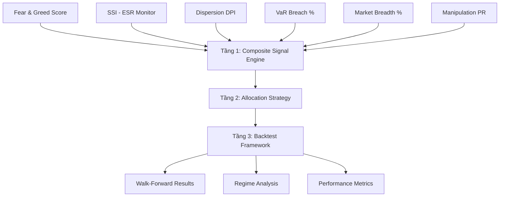

# 📊 Đề Xuất Module Backtest — Quant Platform

## 1. Vấn Đề Cốt Lõi

Platform hiện tại có **9 quant tools** → AI tổng hợp thành **Score (0-100) + Regime**. Nhưng:

- **AI CIO score không backtest được** — vì LLM mới chạy từ gần đây, không có lịch sử dài.
- **Quant signals CÓ THỂ backtest** — vì chúng là công thức toán thuần tuý, có thể tính ngược lại trên dữ liệu lịch sử.

> [!IMPORTANT]
> **Hướng đi đúng**: Backtest phải dựa trên **quant signals thuần tuý** (rules-based), KHÔNG dựa trên AI output.

---

## 2. Kiến Trúc Đề Xuất: 3 Tầng



---

### Tầng 1: Composite Signal Engine (Quantitative CIO Score)

Tạo **Quant CIO Score** thuần rules-based thay vì dựa vào LLM:

| # | Signal Source | Metric | Ý nghĩa |
|---|-------------|--------|---------|
| 1 | Fear & Greed | `Risk_Score` (0-100) | Tâm lý thị trường |
| 2 | ESR Monitor | `SSI` (0-1) | Stress hệ thống VN30 |
| 3 | ESR Monitor | `Market_State` (4 trạng thái) | Regime phân loại |
| 4 | Dispersion | `DPI` (0-100) + `Spread_Z` | Phân tán cấu trúc |
| 5 | Market Breadth | `% > MA125` | Sức khỏe xu hướng trung hạn |
| 6 | VaRES | `Contagion_Index` | Rủi ro lây lan VN30 |
| 7 | Var-CVaR VNINDEX | `ES/VaR Spread` | Rủi ro đuôi |
| 8 | Manipulation | `PR_Corr`, `PR_Slope` | Dấu hiệu thao túng |
| 9 | Upside Ratio | `phi_up`, `phi_down` | Momentum/Mean-reversion |

**Phương pháp tổng hợp:**

```python
# Option A: Equal-weight percentile rank → score 0-100
# Option B: PCA-weighted (giống SSI Aggregator đang có)
# Option C: Regime tree (decision tree trên các signals)
```

> [!TIP]
> **Khuyến nghị:** Dùng **Option A** (equal-weight rank) cho backtest ban đầu, vì:
> - Không có parameter fitting → tránh overfitting
> - Transparent, dễ debug
> - Nếu equal-weight đã có alpha → các cải tiến sau chắc chắn tốt hơn

---

### Tầng 2: Allocation Strategy

Dựa trên Quant CIO Score → xác định **mức phân bổ vốn**:

| Score Range | Regime Label | Equity % | Cash % |
|-------------|-------------|----------|--------|
| 0-20 | Extreme Fear | 10% | 90% |
| 20-40 | Fear / Pre-Crash | 30% | 70% |
| 40-60 | Neutral / Sideway | 50% | 50% |
| 60-80 | Greed / Recovery | 80% | 20% |
| 80-100 | Extreme Greed | 60% | 40% |

> [!NOTE]
> Extreme Greed giảm xuống 60% (không phải 100%) — phản ánh rủi ro reversal khi thị trường quá nóng.

**Equity exposure** có thể là:
- **VN30 ETF** (đại diện cho market) — đơn giản nhất
- **Top N banking stocks** (theo Risk-Adjusted Growth ranking) — phức tạp hơn

---

### Tầng 3: Backtest Framework

#### Nguyên tắc vàng — tránh sai lệch:

| Nguyên tắc | Cách thực hiện |
|-----------|---------------|
| **No look-ahead bias** | Signal ngày T chỉ dùng data đến T-1. Execution tại T+1 close |
| **Walk-forward** | Train trên 2 năm expanding, test trên 1 tháng rolling |
| **Transaction costs** | VN: ~0.35% mỗi chiều (phí + spread + slippage) |
| **Rebalance frequency** | Weekly hoặc khi score vượt ngưỡng (tránh churning) |
| **Benchmark** | Buy-and-hold VNINDEX hoặc VN30 |
| **No survivorship bias** | Universe cố định theo `tickers.csv` tại thời điểm đó |

#### Metrics cần đo:

```
Performance:
  - Total Return, CAGR
  - Sharpe Ratio, Sortino Ratio
  - Max Drawdown, Calmar Ratio

Risk:
  - Volatility (annualized)
  - Tail Risk (VaR 95%, CVaR 95%)
  - Underwater duration (bao lâu dưới đỉnh)

Signal Quality:
  - Hit Rate: % ngày signal đúng hướng
  - Information Ratio
  - Regime accuracy: forward return trung bình theo từng regime
```

---

## 3. Cấu Trúc Code Đề Xuất

```
tools/
└── backtest/
    ├── quant/
    │   ├── composite_signal.py    # Tầng 1: tính Quant CIO Score từ 9 signals
    │   ├── allocation.py          # Tầng 2: score → equity/cash allocation
    │   └── engine.py              # Tầng 3: walk-forward backtest engine
    ├── ui/
    │   ├── sidebar.py             # Chọn thời gian, strategy, benchmark
    │   └── charts.py              # Equity curve, drawdown, regime overlay
    └── page.py                    # Streamlit render
```

---

## 4. Lộ Trình Thực Hiện

### Phase 1: Composite Signal (1-2 ngày)
- [ ] Tạo `composite_signal.py` — chạy 6 tool quant chính trên toàn bộ lịch sử
- [ ] Output: DataFrame với columns = `[date, fg_score, ssi, dpi, breadth_125, var_breach_pct, composite_score]`
- [ ] Validate: so sánh composite_score với AI CIO score trên các ngày đã có trong `Ai_cio_report.csv`

### Phase 2: Backtest Engine (2-3 ngày)
- [ ] Tạo `engine.py` — walk-forward backtest với transaction costs
- [ ] Implement 3 strategies: Buy-Hold, Composite Score Allocation, SSI-only Allocation
- [ ] Tính metrics: Sharpe, MaxDD, CAGR, Calmar

### Phase 3: UI Dashboard (1-2 ngày)
- [ ] Trang backtest trên Streamlit
- [ ] Equity curve chart, drawdown chart, regime overlay
- [ ] Bảng so sánh strategies

### Phase 4: Validation (1 ngày)
- [ ] Cross-validate: kiểm tra composite signal trên out-of-sample
- [ ] Stress test: chỉ test trên giai đoạn giảm mạnh (COVID, 2022 crash)

---

## 5. Quan Điểm Kỹ Thuật Quan Trọng

### Tại sao KHÔNG backtest AI CIO trực tiếp?

1. **LLM output không deterministic** — cùng input chạy 2 lần ra 2 kết quả khác nhau
2. **LLM có knowledge cutoff** — model 2026 "biết" các sự kiện quá khứ → look-ahead bias ngầm
3. **Chi phí** — chạy LLM cho 1000+ ngày lịch sử = tốn hàng trăm USD API
4. **Không reproducible** — người khác không thể replicate kết quả

### Tại sao dùng Composite Signal rules-based?

1. **Deterministic** — cùng input = cùng output, mọi lúc
2. **Tính ngược được** — chạy trên 6 năm dữ liệu đã có trong `market_data.csv`
3. **Transparent** — biết chính xác tại sao signal thay đổi
4. **Rẻ** — không tốn API, chạy offline
5. **Validate AI** — dùng composite score làm "ground truth" để đo xem AI CIO có thêm alpha hay không

> [!WARNING]
> **Cảnh báo về overfitting**: Nếu tối ưu quá nhiều tham số trên dữ liệu lịch sử, backtest sẽ đẹp nhưng live trading sẽ tệ. Giữ số parameter tối thiểu (ideally = 0 nếu dùng equal-weight rank).

---

## 6. Câu Hỏi Cần Quyết Định

1. **Universe**: Backtest trên VNINDEX (mua ETF) hay trên nhóm banking stocks cụ thể?
2. **Rebalance**: Weekly, monthly, hay signal-triggered?
3. **Benchmark**: Buy-hold VNINDEX hay Buy-hold VN30?
4. **Data range**: Backtest từ khi nào? (data hiện có bao lâu trong `market_data.csv`?)
5. **Short selling**: Có cho phép short hay chỉ long-only + cash?
